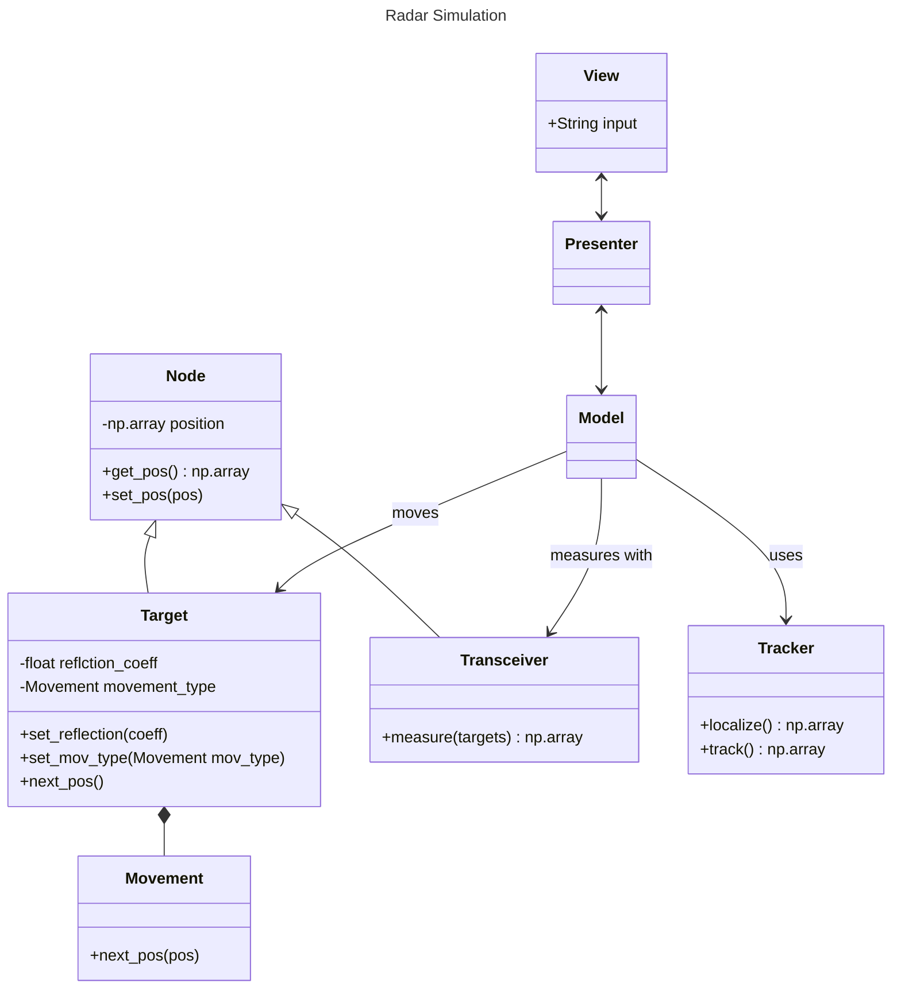

# radar_sim
This repository is about the simulation of multiple moving object tracking using multiple radars. 

# Kanban Plan
## Todo
- Investigate not only the reflexions but also the transmissions (think of a microphone array and how you can calculate the angle with the delay between the microphones)
- Implement Gauss-Newton Algorithm to reduce the errors or WLLS (Weightes Linear Least Squares)
- Use a NN (read the paper)
- Use Doppler effect and phase to simulataneouly measure distance and velocity
- Tackle NLOS (Non-Line-Of-Sight) issues (there is a paper doing this with NN)
- Use RSS to mitigate the error further

## Doing
- Tracking:
  - Filtering (Kalman?)
  - Data Association
  - Track Management
- Plot the errors
- program keyboard controls

## Done 
- Simulation of movement
- Simulation of radars and signal processing
- Localization of a single object
- Localization of multiple objects
- Code cleanup

# Code Structure
- The code base was fully renewed with Object Oriented Programming
- The MVP Pattern is used to structure code
- The rough UML class diagram looks like this:

