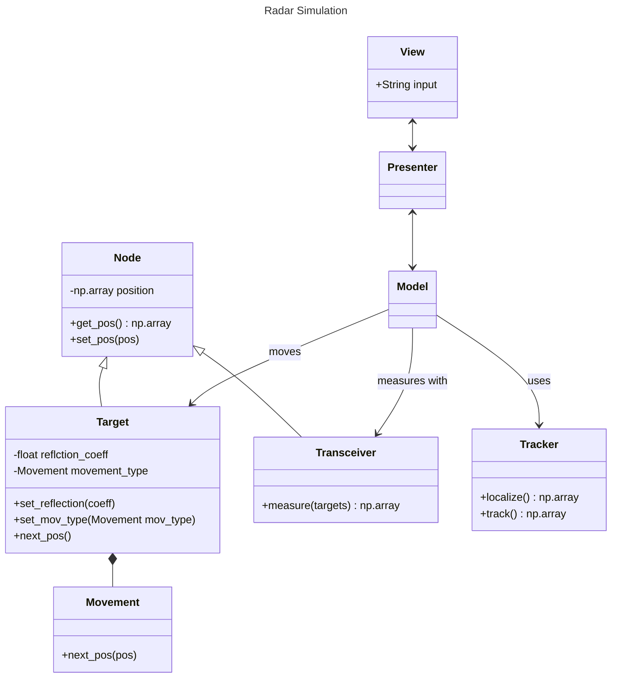

# radar_sim
- This project tries to simulate an FMCW radar tracking system
- Multiple targets can be placed anywhere with given movement types
- Multiple FMCW radars can be positioned to make localization and tracking possible using algorithms like Multilateration and GNN (Global Nearest Neighbor)
- Transmission signals are not investigated because synchronization is too expensive
- Movement types currently supported:
    - constant
    - linear
    - circular
- The simulation can be controlled with the keyboard for better debugging:

| Key | Function |
| --- | -------- |
| p   | pause    |
| c   | continue |
| s   | step     |
| q   | quit     |

# Kanban Plan
## Todo
- Refine the FMCW signal theory
- Implement CFAR (Constant False Alarm Rate) rather than a fixed threshold
- Optimize the maximum finding algorithm
- Train an NN to have an adaptive threshold to choose the correct targets after MLAT
- Implement Gauss-Newton Algorithm to reduce the errors or WLLS (Weightes Linear Least Squares)
- Use a NN
- Tackle NLOS (Non-Line-Of-Sight) issues (there is a paper doing this with NN)
- Use RSS?
- Use velocity too? Do we have a simple LFMCW radar or something more advanced like CW-LFMCW? Do we have different modulation techniques?
- Filtering:
    - Filtering (Kalman-Filter or Particle Filter) are not of high priority because:
        - we have a very precice sensor (radar)
        - we have only one sensor (if you class the radar system as 1 sensor for the location), so no sensor fusion has to be applied
        - we don't have any knowledge of the state transition model (we don't know anything about the movement type. Any target could move arbitrarily)
    - Filtering might still be helpful if:
        - we occasionally loose the target
        - in the real system, the noise is higher
        - we have model knowledge f.e. in the real system
        - we combine multiple sensors (f.e. if we can measure the velocity too)

## Doing
- Tracking:
    - Data Association: Associate targets to tracks. Also initiate or delete tracks
- Plot Errors for Tracks

## Done 
- Simulation of movement
- Simulation of radars and signal processing
- Localization of a single object
    - The LLS algorithm was used for the multilateration problem
- Localization of multiple objects
    - A novel algorithm was used to locate multiple passive targets
    - The LLS algorithm was calculated for every combination of distances, yielding $T^R$ positions where $T$ is the number of targets and $R$ the number of radars / transceivers.
    - To filter out the less probable targets, a cost was calculated based on the predicted positions and the distances measured:
$$c_j = \sum_{i=0}^{T} (m_{i,j} - p_{i,j})^2$$
    - with the index $j \in [0, T^R]$ for every prediction where $m_{i,j}$ is the measured distance from radar $i$ to the prediction $j$. The measured distance is subtracted from the predicted distance to that target $p_{i,j}$. This is repeated for every target $i$ for a specific prediction $j$. This cost is stored for each prediction $j$ and should be as low as possible (ideally 0). The true predictions are filtered out based on this cost by a threshold value for now.
- Code cleanup
- Integrated Keyboard controls for the simulation
- Plot the raw radar signal with the chosen maxima
- Clustering: Fuse the same target points to one single target. DBSCAN was used as a first implementation since it allows clusters in arbitrary shape. Further improvements might be to use HDBSCAN* or SDPFC[^tracking_book]

# Project Structure
- The code base was fully renewed with Object Oriented Programming
- The MVP Pattern is used to structure code
- The rough UML class diagram looks like this:

# Footnotes
[^tracking_book]: Lin Cao et al. (October 2021). Target Recognition and Tracking for Millimeter Wave Radar in Intelligent Transportation

