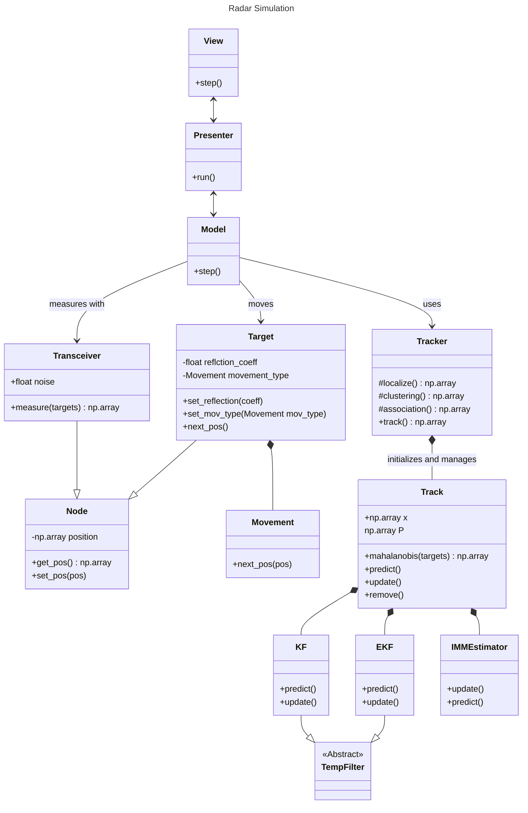

# radar_sim
- This project tries to simulate an FMCW radar tracking system
- Multiple targets can be placed anywhere with given movement types
- Multiple FMCW radars can be positioned to make localization and tracking possible
- The plane wave assumption for the radars are assumed
- Transmission signals are not investigated because synchronization is too expensive
- Movement types currently supported:
    - constant
    - linear
    - circular
- A basic implementation of a tracker was done using the following algorithms:
    - A novel approach for Multilateration described below to detect multiple passive targets using only the distances of the radar measurements
    - DBSCAN for clustering multiple reflections of the same target
    - IMM-Estimator with a KF and an EKF to include the CT and CV motion models for filtering, smoothing and prediction and to support maneuvers
    - GNN for data association with a scoring function to not lose tracks if they are not detected
- The Algorithms used for this tracker are programmed so it is possible to easily switch them out and test other ones
- The simulation can be controlled with the keyboard for better debugging:

| Key | Function |
| --- | -------- |
| p   | pause    |
| c   | continue |
| s   | step     |
| q   | quit     |

# Kanban Plan
## Todo
- Implement CFAR (Constant False Alarm Rate) rather than a fixed threshold
- Make use of the velocities
- Use a NN for tracking
- Train an NN to have an adaptive threshold
- Optimize the maximum finding algorithm
- Implement random Clutter[^cambridge_tracking]
- Clutter measurement density estimation[^cambridge_tracking]
- Implement Gauss-Newton Algorithm to reduce the errors or WLLS (Weighted Linear Least Squares)
- Tackle NLOS (Non-Line-Of-Sight) issues (there is a paper doing this with NN)
- Make use of RSS
- TBD (Track before detect) instead of DBT (Detect before track)?
- Plot Errors for Tracks
- Work on the IMM-Estimator
    - Extend IMM-Estimator for KF to have a CA model
    - Optimize the Matrices and initializations
    - Use the PF or UKF

## Doing
- Refine the FMCW signal theory
    - Distance-dependent amplitude
    - Angle-dependent RCS (Radar Cross Section)

## Done 
- Simulation of movement
- Simulation of radars and signal processing
- Localization of a single object
    - The LLS algorithm was used for the multilateration problem[^loc_book][^multilat_paper]
- Localization of multiple objects
    - A novel algorithm was used to locate multiple passive targets
    - The LLS algorithm was calculated for every combination of distances, yielding $T^R$ positions where $T$ is the number of targets and $R$ the number of radars / transceivers.
    - To filter out the less probable targets, a cost was calculated based on the predicted positions and the distances measured:
$$c_j = \sum_{i=0}^{T} (m_{i,j} - p_{i,j})^2$$
    - with the index $j \in [0, T^R]$ for every prediction where $m_{i,j}$ is the measured distance from radar $i$ to the prediction $j$. The measured distance is subtracted from the predicted distance to that target $p_{i,j}$. This is repeated for every target $i$ for a specific prediction $j$. This cost is stored for each prediction $j$ and should be as low as possible (ideally 0). The true predictions are filtered out based on this cost by a threshold value for now.
- Code cleanup
- Integrated Keyboard controls for the simulation
- Plot the raw radar signal with the chosen maxima
- Clustering: Fuse the same target points to one single target. DBSCAN was used as a first implementation since it allows clusters in arbitrary shape. Further improvements might be to use HDBSCAN* or SDPFC[^tracking_book]
- Filtering: IMM (Interactive Multiple Model) Estimator was implemented using KF (Kalman Filter) and EKF (Extended Kalman Filter) with 2 motion models for CV (constant velocity) and CT (constant turn)[^cambridge_tracking]. The Filtering works for a single target for now. After Data Association it will be for multiple targets.
- Data Association: GNN (Global Nearest Neighbor) was implemented. Improvement: Use PDA (Proabilistic Data Association) Algorithms

# Project Structure
- The code base was fully renewed with Object Oriented Programming
- The MVP Pattern is used to structure code
- The rough UML class diagram looks like this:

# Footnotes
[^tracking_book]: Lin Cao et al. (October 2021). Target Recognition and Tracking for Millimeter Wave Radar in Intelligent Transportation
[^loc_book]: S. A. (Reza) Zekavat and R. Micheal Buehrer (2019). Handbook of Position Localization. Theory, Practice, and Advances
[^multilat_paper]: Vinh Tran-Quang et al. (2013). Target Tracking System using Lateration Estimation Method in Wireless Sensor Networks
[^cambridge_tracking]: Subhash Challa et al. (2011). Fundamentals of Object Tracking

